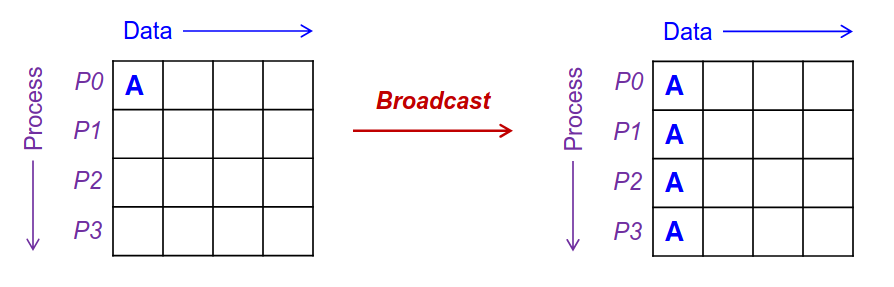
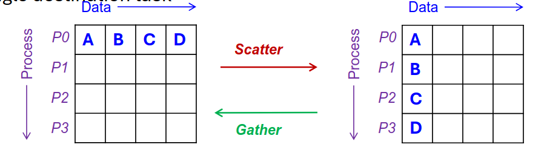
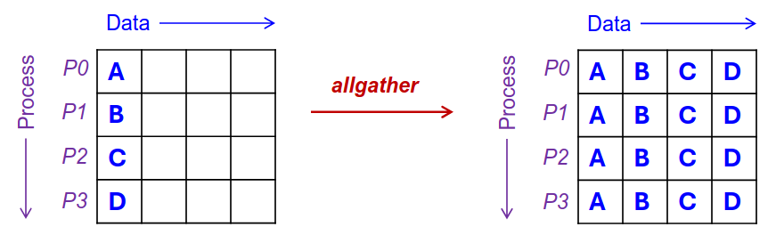
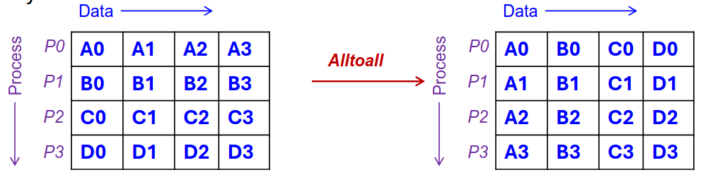
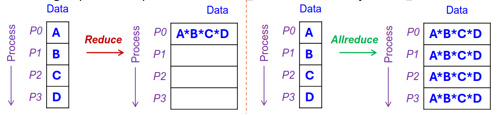
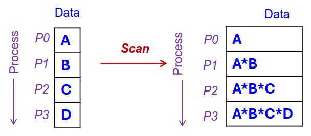

### 📘 **Distributed Systems – Programming Models (Part 1)**

---

### ✅ **Why Parallelism?**

* **Parallelism**: Running multiple tasks simultaneously to boost **performance** and **efficiency**.
* Example: Calculating sum of a large array using multiple processors.

#### 🔁 **Ideal vs Actual Parallelization**

* **Ideal**: Perfect balance and speed-up.
* **Actual**: Has **overhead** (e.g., communication delays) and **imbalanced loads**.

#### 💡 Guidelines for Effective Parallelism:

1. Maximize the parallelizable part of the program.
2. Balance workload across processes.
3. Minimize communication time.

---

### 🖥️ **Parallel Computer Architectures**

| Feature       | Symmetric Multiprocessor (SMP) | Massively Parallel Processor (MPP) |
| ------------- | ------------------------------ | ---------------------------------- |
| Memory        | Shared                         | Separate per processor             |
| Communication | Shared memory                  | Message passing                    |
| Scalability   | Limited                        | High                               |
| Programming   | Easier                         | More complex                       |
| Use Case      | Quick shared data access       | Heavy computations                 |

---

### 🧩 **Traditional Parallel Programming Models**

#### 1. **Shared Memory Model**

* Tasks access the **same memory space**.
* Communicate via **shared variables**.
* Easier programming (e.g., threads).
* Use **locks** to prevent concurrent write conflicts.

#### 2. **Message Passing Model**

* Each process has its **own memory**.
* Communicate via **explicit messages**.
* Example: **MPI** (Message Passing Interface).
* More scalable, suitable for distributed systems.

---

### 💬 **Message Passing Interface (MPI)**

#### 🧱 Key Concepts:

* **Communicators and Groups**: Define sets of processes that can communicate.
* **Ranks**: Each process has a unique ID (rank).

#### 🔁 **Point-to-Point Communication**

* One process sends, another receives.
* Can lead to **deadlocks** if not managed correctly (e.g., circular waits).

#### 🤝 **Collective Communication Patterns**:

1. **Broadcast** – One process sends data to all. 
    
2. **Scatter** – One process sends unique data to each. 
3. **Gather** – One process collects data from all. 
   
4. **Allgather** – All gather and share data with all. 
   
5. **Alltoall** – Everyone sends to everyone. 
   
6. **Reduce** – Combine data (e.g., sum) and return to one process. 
7. **Allreduce** – Like Reduce, but result goes to all. 
   
8. **Scan** – Partial reduce (e.g., prefix sum).
  

---

### ⚠️ MPI Considerations

* All participating processes **must** engage in collective communication.
* Operations are **blocking** and **synchronous**.
* No message tags in collective communication.
